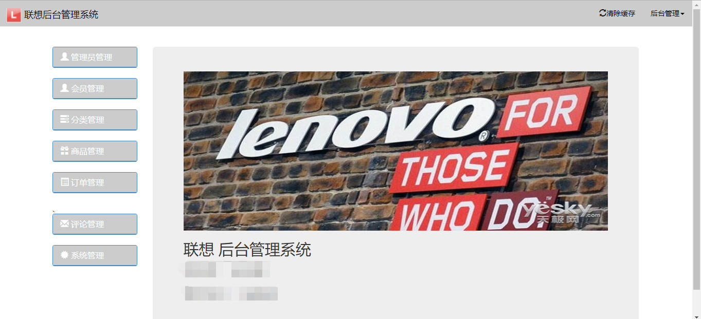

# 该项目为联想后台管理系统

###### 模块：

- 登录注册模块

- 管理员及用户管理模块

- 商品管理模块

- 订单管理模块

- 评论管理模块

- 分类管理模块

- 系统管理模块

  - 轮播图管理

  - 广告管理

  - 分类广告管理 
###### 项目大致实现了电商的整体流程，从前台页面展示、购物、选择商品到后台的各类管理都实现相关功能
###### 数据库没有采用迁移和填充文件，使用的原生数据表

**管理员**

​		账号：admin123

​		密码：123123（管理员密码全为123123）

**用户**

​		账号：邮箱（已实现通过邮箱找回密码功能）

​		密码：123456(用户密码全为123456)

## **其他的我也不多详细说了，可以自行下载去一探究竟**

